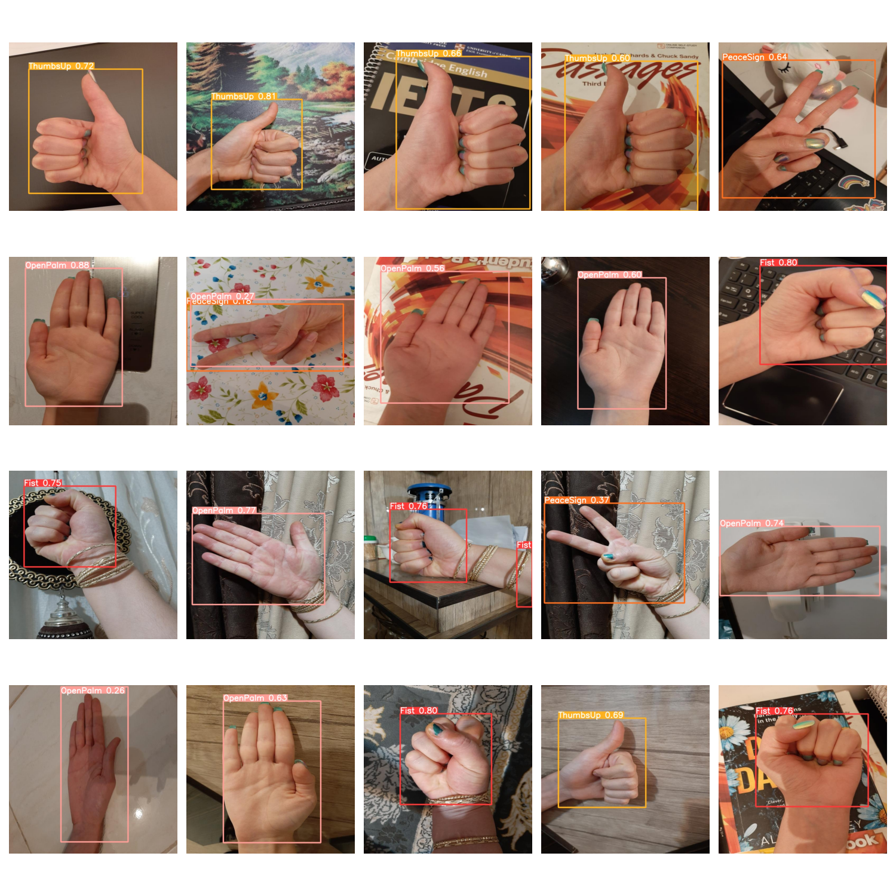

# YOLOv5-Hand-Gesture
This repository is for implementing YOLOv5 for hand gesture recognition. **The dataset consists of 200 images of four hand gesture classes: Fist, OpenPalm, PeaceSign and ThumbsUp**. The dataset was created by myself.

First, I used the Roboflow website to label my dataset and perform data augmentation, resulting in a **total of 408 images**.

The **training dataset consisted of 368 images**, while the **validation and test datasets each comprised 20 images**. Using this site, I imported my dataset into Google Colab. Then, following the guide provided by the YOLOv5 repository, I proceeded with the training.

During training, the model achieved a **precision of 93% for all classes**, with individual class precisions as follows: **92% for Fist, 91% for OpenPalm, 90% for PeaceSign, and an impressive 99% for ThumbsUp**.

After training, I evaluated the model using the test dataset. Below is an example output image generated by the model:

